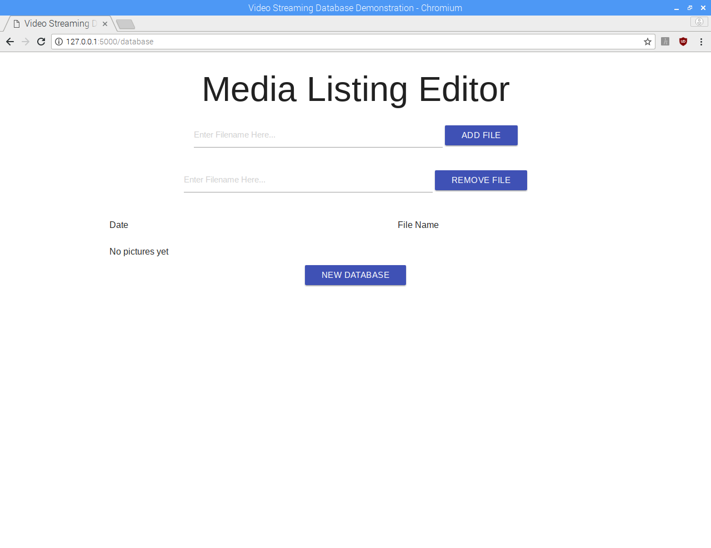

flask-video-streaming
=====================
A small camera streaming server and project for the University of Michigan. Built using
Python Flask and JQuery.

The main idea behind this project to to take advantage of the inexpensive hardware that
has come on the market recently, and use it to stream video to hardware everyone already
uses. For example, you could put a camera on a Raspberry Pi strapped onto an RC car, and
stream the video back to your phone for an inexpensive FPV vehicle.

### Features

* Real-Time video streaming
* Picture taking
* Video Recording
* Downloading saved pictures and video
* Adding/Removing pictures and video from listing

### Hardware Requirements

* 1Ghz processor
* 512Mb RAM
* ?? Space for all the videos and pictures

Runs on Raspberry Pi Zero W, 3, 3B+ and whatever x86 box you have around. The video
saving will benifit from having multiple cores and a fast connection to your storage
medium.

Works with any camera OpenCV can talk to (webcams, PlayStaion Eye, etc.), and
has support of the Raspberry Pi camera (though this hasn't been tested in a while).
Higher resolution cameras will require a stronger processor to keep the stream going
at a resonable rate.

Installing and Setup
====================
Use Python3 and pip3 if your system has multiple versions of Python installed.

Grab our key dependencies, Flask and OpenCV. If you are going to be running
this on a Raspberry Pi, you may have to build OpenCV from source. The versions
that we are looking for are:

```
Flask  >= 0.10.1
OpenCV >= 3.0.0
```

Using pip, we should grab all the dependencies we need when we get Flask:

```
$ pip install Flask
```

Then clone or download the server:

```
$ git clone https://github.com/mlightning3/flask-video-streaming
```

Now connect a camera to the computer, and run:

```
$ python app.py
```

You should now have a live status update from the Flask server in the terminal.
To connect to it, load up a web browser (any except IE) and go to 127.0.0.1:5000
and you should see a live feed from the camera.


Now to set up the database for saving pictures and video, go to 127.0.0.1:5000/database
and click on the "New Database" button. Now you are all set to save pictures and videos.



To use this, point the browser of the device you want to view your stream from
to the IP address of the computer running the server with :5000 appended to the end.


You can have multiple devices viewing the stream, but that hasn't been tested as
throughly as when just one device is viewing the stream.

Copyright
=========
University of Michigan 2017-2018

Based on Miguel Grinberg's [video streaming with Flask](http://blog.miguelgrinberg.com/post/video-streaming-with-flask) 2014.

Licensed under the MIT license.

This program is distributed in the hope that it will be useful,
but WITHOUT ANY WARRANTY; without even the implied warranty of
MERCHANTABILITY or FITNESS FOR A PARTICULAR PURPOSE.